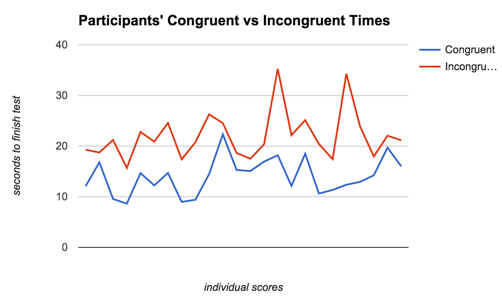
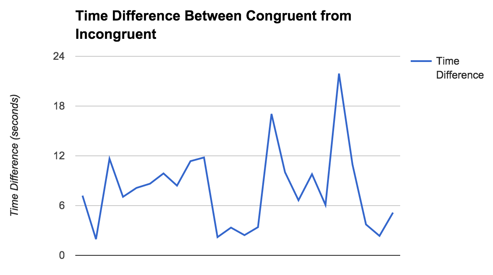

# Resources
- https://en.wikipedia.org/wiki/Central_tendency

# Questions

1. What is our independent variable? What is our dependent variable?
The independent variable is the printed word, and the dependent variable is how long it takes for a participant to finish naming the ink colors in a list of words.

2. What is an appropriate set of hypotheses for this task? What kind of statistical test do you expect to perform? Justify your choices.
I would make the hypothesis that incongruently printed words don't have an effect on how long it takes someone to finish naming the ink colors in a list of words. I expect to run a dependent t-test against the data to determine if I should accept or reject my null hypothesis. A t-test helps me determine if the set of values in one sample (incongruent) is different enough from a random sampling I might get from a population (incongruent and congruent) that I can say that the incongruency is definitely making an impact on naming time. I would do a two-tailed test, because a one-tailed test assumes that there definitely _is_ an effect. Because it is a dependent t-test, it will help me determine if there's any statistically important difference between a person's congruent time and their incongruent time.

Now it’s your chance to try out the Stroop task for yourself. Go to this link, which has a Java-based applet for performing the Stroop task. Record the times that you received on the task (you do not need to submit your times to the site.) Now, download this dataset which contains results from a number of participants in the task. Each row of the dataset contains the performance for one participant, with the first number their results on the congruent task and the second number their performance on the incongruent task.

Congruent task: 13.180 seconds
Incongruent task: 19.249 seconds

3. Report some descriptive statistics regarding this dataset. Include at least one measure of central tendency and at least one measure of variability.
All:
- median: 17.735
- mean: 18.034
- population st. dev.: 5.740
Congruent:
- median: 14.357
- mean: 14.051
- sample st. dev.: 3.559
Incongruent:
- median: 21.018
- mean: 22.016
- sample st. dev.: 4.797

4. Provide one or two visualizations that show the distribution of the sample data. Write one or two sentences noting what you observe about the plot or plots.

This graph shows the two different sets of time sfor congruent vs. incongruent times paired for each participant. It's easy to see that the incongruent times are larger than the congruent times in every single instance.

This graph shows the conputed difference in time to completion between the incongruent task set and the congruent task set. It's easy to see the min and max values here and to visually get an idea of what the average value range might be (somewhere between 6 and 12 seconds).

5. Now, perform the statistical test and report your results. What is your confidence level and your critical statistic value? Do you reject the null hypothesis or fail to reject it? Come to a conclusion in terms of the experiment task. Did the results match up with your expectations?
My two-tailed paired t-test result: 0.00000004103.
With a p-critical value of 0.001, I can safely reject the null hypothesis and say that yes: the congruent and incongruent times are very different from each other. It would seem that we can draw the conclusion that an incongruent word/ink color pairing does have an affect on participant reading time, and that it negatively impacts finish time. These results did match up with my expectations.
